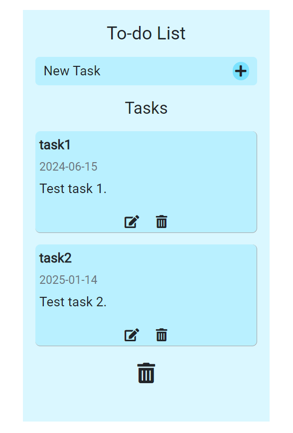

# TODO App

> TODO App which can edit, add and delete tasks using a Bootstrap modal. A confirm box when deleting all tasks. Drag and drop the order of tasks.

## Table of contents

- [General info](#general-info)
- [Screenshots](#screenshots)
- [Technologies](#technologies)
- [Setup](#setup)
- [Features](#features)
- [Status](#status)
- [Inspiration](#inspiration)
- [Contact](#contact)

## General info

Project to practise CRUD operations in JavaScript. Includes add/edit/delete tasks, 'drag and drop', 'delete all' and scroll bar features.

## Screenshots

## Technologies

- HTML
- CSS
- JavaScript
- Bootstrap

## Setup

Open the index.html in any modern browser.

## Features

- Add/delete/edit tasks
- Delete all tasks including a pop up box to confirm
- Drag and drop tasks to prefered order
- Scroll bar

## Status

Project is: _finished_

## Inspiration

Based on https://www.freecodecamp.org/news/learn-crud-operations-in-javascript-by-building-todo-app/ with drag and drop, delete all tasks, scroll bar and improved styling added by myself.

## Contact

Created by billsboroughscott@gmail.com - feel free to contact me.
